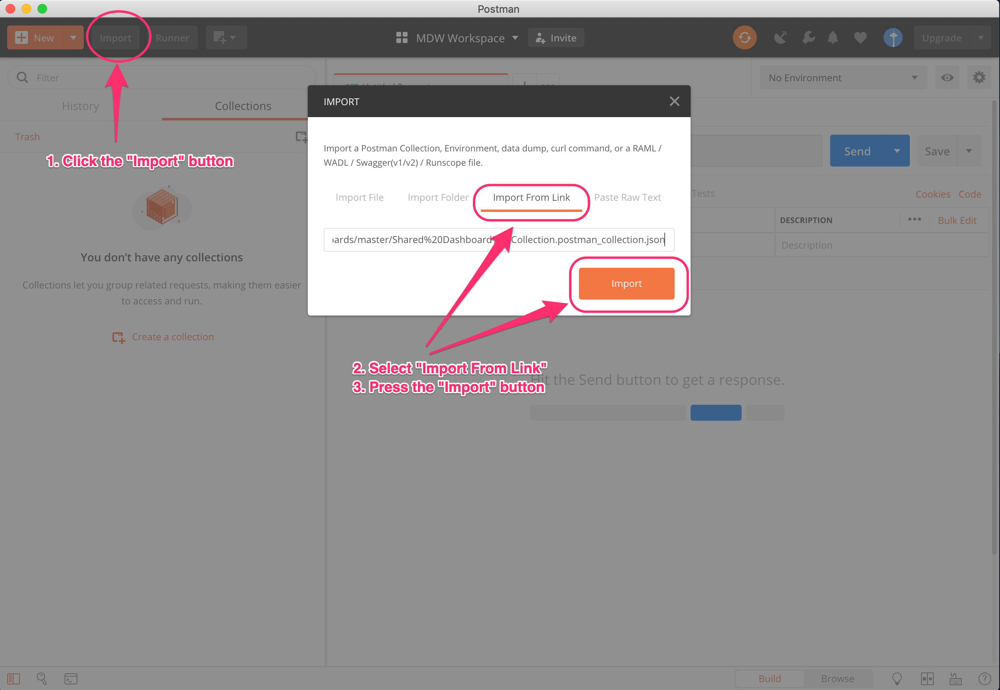
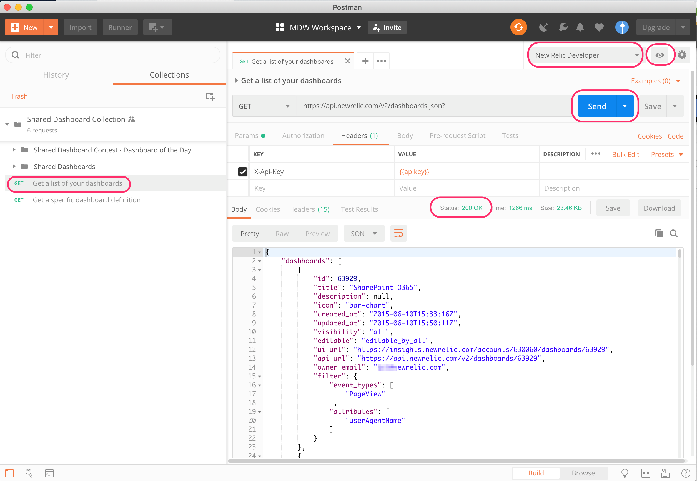

# Using Postman with Shared Dashboards Collection
There are lots of ways to invoke New Relic APIs. For example, you can use the [API Explorer](https://api.newrelic.com/) as a way to see all of the available APIs and invoke them directly in your browser. However, the API Explorer does not provide you with examples, e.g. dashboard definitions, that you can use when you invoke the APIs. Using Postman, we'll be able to provide you with a more diverse set of examples that you can tailor to your own needs. This document will show you how to setup Postman in order to use the Shared Dashboards collection contained in this repository. Feel free to contribute your own ideas as well via a pull request. Let us know if you have any other comments or feedback.
Enjoy!

## Setup
There are two basic steps you need to do in order to use this collection once you have downloaded Postman. First, you need to get an API key.
>Note: In oder to invoke the Insights Dashboard API, you must have a key with **Admin level** permissions. See [understanding New Relic API keys](https://docs.newrelic.com/docs/apis/getting-started/intro-apis/understand-new-relic-api-keys) for more details.

### Step 1: Import the Shared Dashboard Collection
Open Postman and click on the "Import". This will open up a dialog box with several options. One easy way is to simply use the [URL for the raw file](https://raw.githubusercontent.com/newrelic/shareddashboards/master/Shared%20Dashboard%20Collection.postman_collection.json) of the exported collection directly from this repo. Select "Import from Link" and enter that URL into the dialog box, then press "Import".

For more information, please refer to the [Postman documentation on importing collections](https://www.getpostman.com/docs/v6/postman/collections/data_formats)

### Step 2: Create a Postman Environment
Each New Relic API request must pass an authorization key as part of the header. In addition, other requests will take parameters, e.g. dashboard_id, as part of the URL. Postman uses the notion of an "environment" to manage the variables that will be used in requests. To use the Shared Dashboard collection, you will need two environment variables, **apikey** and **dashbaord_id**.
>Note: You can find your API key in New Relic by going into the "Account Settings" menu, then selecting "API Keys" under the "Integrations" heading on the left hand side.

Create the enviornment from the upper right hand corner "gear" icon. This will open the "Add Environment" dialog box. In the "VARIABLE" column, add the **apikey** variable and then paste in your key. Create another variable, **dashboard_id**, but leave its value empty.

Next, you will name your environment. In the screen capture below, we use the name *New Relic Developer*, but choose the name of your choice.
Click the "Add" button to create the environment, then the "X" on the top right of the dialog to close it.

For more information, please refer to the [Postman documentation on environments](https://www.getpostman.com/docs/v6/postman/environments_and_globals/intro_to_environments_and_globals)

### Step 3: Invoke the Dashboard APIs
At this point, you should have the shared dashboard collection imported and your environment setup. Now we are ready to try out invoking the dashboard APIs.
>**Note: Make sure to select your environment from the upper right drop down list.**

On the left hand side, select the "Get a list of your dashboards" request.
Press the "Send" button on the right hand side. The result should look similar to the screen shot below, with a status of 200 and the JSON result that contains our dashboards.

#### GET a specific dashboard definition
To get a specific dashboard definition, set the "dashboard_id" environment variable to one of the IDs returned from the GET dashboards call you just made and use the "Get a specific dashboard definition" request.

# Shared Dashboard Contest
Now that you know how easy it is to work with the API, we are encouraging you to share your favorite dashboard! From November 26th, 2018 through December 9th, 2018, New Relic will be running a ["Shared Dashboards"](https://newrelic.com/shareddashboards) contest in the community. You could win an Apple watch! All yoiu have to do is create a dashboard, tell us a bit about it, post a screen shot and some of your queries.  

To provide some "inspiration", each day of the contest, we will be uploading a new "Dashboard of the Day". We'll also be updating this collection with the dashboard's definition so that you can try it out in your own instance of New Relic. So make sure to check back often for updates and you learn how to build on New Relic!

## References
[Shared Dashboard Contest](https://discuss.newrelic.com/t/shared-dashboards-contest-add-your-queries-here/60634)
[New Relic Developer Program](https://developer.newrelic.com/)
[New Relic Community](https://discuss.newrelic.com/c/build-on-new-relic)
[New Relic API Explorer](https://api.newrelic.com/)
[Understanding New Relic API Keys](https://docs.newrelic.com/docs/apis/getting-started/intro-apis/understand-new-relic-api-keys)
[Community Topic - Shared Dashboards](https://discuss.newrelic.com/c/build-on-new-relic/shared-dashboards)
[Postman Shared Dashboard Collection](https://raw.githubusercontent.com/newrelic/shareddashboards/master/Shared%20Dashboard%20Collection.postman_collection.json)
[Get Postman](https://www.getpostman.com/)
